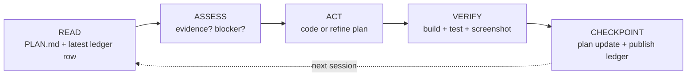
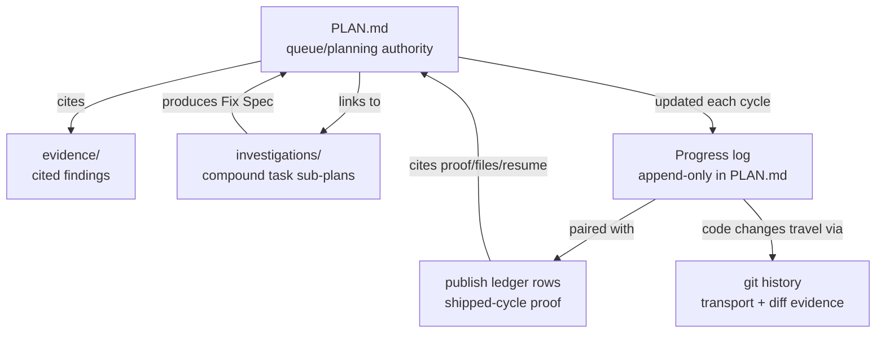

# Architecture

Vidux has three layers: **doctrine** (the rules), **the cycle** (the loop), and **the store** (the files).

```
┌─────���─────────────────────────────────────────┐
│                   DOCTRINE                    │
│  5 principles + gate patterns + stuck detect  │
└──────────────────────┬────────────────────────┘
                       │ governs
┌──────────────────────▼──────────────────────���─┐
│                   THE CYCLE                   │
│  Read → Assess → Act → Verify → Checkpoint   │
└──────────────────────┬─────────────────��──────┘
                       │ reads/writes
┌──────────────────────▼────────────────────────┐
│                   THE STORE                   │
│  PLAN.md + publish ledger + evidence + git    │
└─────────────────────────��─────────────────────┘
```

## File Layout

```
vidux/
├── SKILL.md              # Full contract: principles, cycle, PLAN.md template
├── DOCTRINE.md           # Extended doctrine (12 principles + gate patterns)
├── LOOP.md               # Stateless cycle mechanics
├── ENFORCEMENT.md        # Claude Code hook configuration
├── commands/             # Slash commands: /vidux (single entry — discipline + automation)
├── references/           # Deep docs loaded on demand (automation.md)
├── scripts/
│   ├── lib/              # Shared shell functions (compat.sh, etc.)
│   ├── vidux-loop.sh     # Cron driver — fires the cycle
│   ├── vidux-checkpoint.sh
│   ├── vidux-doctor.sh   # Diagnose plan/store health
│   └── vidux-fleet-*.sh  # Fleet management utilities
├── hooks/                # Git hooks for plan discipline
│   ├── hooks.json        # Claude Code hook definitions
│   ├── pre-commit-plan-check.sh
│   ├── post-commit-checkpoint.sh
│   └── three-strike-gate.sh
├── guides/               # Deep dives (not needed for basic use)
│   ├── draft-pr-flow.md  # How automation lanes push code
│   ├── fleet-ops.md      # Automation fleet management
│   ├── harness.md        # Writing automation prompts
│   ├── investigation.md  # Compound task L2 format
│   └── evidence-format.md
├── tests/                # Contract tests (pytest)
│   └── test_vidux_contracts.py
└── examples/             # Worked examples
    └── bug-fix-lifecycle/
```

## The Cycle

Every agent session — human-triggered or cron — runs the same five steps:



**Read:** Load PLAN.md, check the latest matching publish or handoff ledger row, check for in-progress tasks (crash recovery), and scan git log/diff.

**Assess:** Does the next task have evidence? If yes, execute. If no, gather it locally — no commit or PR until the fix ships.

**Act:** Execute one task or refine the plan. Agents keep working through the queue until they hit a real boundary — context limit, external blocker, or empty queue.

**Verify:** Build must pass. Tests must pass. UI work requires visual proof (screenshot, simulator). "It works" is never sufficient.

**Checkpoint:** Update Progress/Tasks/Drift Log in PLAN.md, emit a publish ledger row with proof, handoff status, files claimed, and next-agent resume, then use git commit/push only as transport when code changed.

## The Store

Planning state lives in markdown files in git, and shipped-cycle proof lives in append-only publish ledger rows. No product database or chat history is the coordination store.



A project has exactly **one PLAN.md** as its queue/planning authority. Course corrections update the Decision Log or Drift Log -- they never spawn a sibling plan. Evidence files back every plan entry. Matching publish ledger rows prove shipped cycles with task id, proof, handoff status, files claimed, and resume metadata. Investigation files handle compound tasks that need root cause analysis before code.

## Fleet Architecture

For automation at scale, vidux supports multiple agents working the same plan:

```
Writer Agent     ──┐
Radar Agent      ──┼── all read/write ──> PLAN.md (git branch)
Coordinator      ──┘
```

- **Writers** ship code. One writer per project surface.
- **Radars** monitor surfaces (read-only). They find work; they never fix it.
- **Coordinators** audit the fleet — flag stuck agents, handoff gaps, bimodal quality.

Each agent runs as a stateless cron. They share queue state through PLAN.md, shipped-cycle proof through publish ledger rows, and transport/diff evidence through git, never through chat memory or message passing.

## Extensions — external adapters

Vidux core is markdown + git. Extensions plug external systems (kanban boards, issue trackers, project planners) into the same store via a small contract — without changing the cycle or the discipline.

```
┌──────────────────────────────────────────────────────┐
│                   THE STORE                          │
│  PLAN.md + publish ledger + evidence + git           │
└──────────────┬─────────────────────────┬─────────────┘
               │                         │
               │ adapters/               │ vidux.config.json
               ▼                         ▼
┌──────────────────────────────────────────────────────┐
│                   EXTENSIONS                         │
│                                                      │
│  AdapterBase (6 methods, status-orthogonal blocked) │
│      │                                               │
│      ├── gh_projects   ─── GitHub Projects v2 API    │
│      ├── linear        ─── Linear GraphQL            │
│      ├── asana / jira / trello (stubs)               │
│      └── <your adapter here>                         │
│                                                      │
│  scripts/vidux-inbox-sync.py — round-trip reconciler │
└──────────────────────────────────────────────────────┘
```

**Six-method contract.** Every adapter implements `fetch_inbox`, `push_task`, `pull_status`, `push_status`, `pull_fields`, `push_fields`. Status pipeline (`pending` → `in_progress` → `in_review` → `completed`) is the column. The Blocked flag is **orthogonal** — written via `push_fields({'_blocked': True})` so the pipeline column never moves when an item gets blocked. `push_status(BLOCKED)` is reserved and must raise.

**Composition over migration.** Adapters are additive. A repo's `vidux.config.json` can list multiple `inbox_sources` entries — `gh_projects` and `linear` coexist; cards minted on one stay on that surface and never bridge. Per-adapter quota buckets stay independent: GitHub PAT vs Linear personal-key never share a rate limit.

**Sync split.** The repo ships one sync entry point, `scripts/vidux-inbox-sync.py`. Operators can scope scheduled runs per adapter with `--only-adapter` when they want independent cadences or credential buckets:

| Invocation shape | Scope | Credential bucket |
|------|-------|-------|
| `python3 scripts/vidux-inbox-sync.py --config <repo>/vidux.config.json --only-adapter gh_projects --direction=both` | GitHub Projects only | GitHub token file |
| `python3 scripts/vidux-inbox-sync.py --config <repo>/vidux.config.json --only-adapter linear --direction=both` | Linear only | Linear token file |
| `python3 scripts/vidux-inbox-sync.py --config <repo>/vidux.config.json --direction=both` | All enabled adapters for that repo | All configured token files |

The repo does not ship scheduler wrappers for these sync passes; a fleet can run one combined invocation or separate scheduler entries per adapter.

**State sidecar.** Per-plan `<plan_dir>/.external-state.json` stores the `task_id ↔ external_id` map per adapter, plus adapter-specific metadata (Linear's task_metadata sidecar after the 2026-04-25 description-codec drop). Gitignored. **Never lose this file** — `git stash drop` after a rebase that captured it permanently breaks the dedup story; always `git stash pop`.

**Auto-promote.** When an adapter's config sets `auto_promote_target: <plan-dir>`, novel external items skip `INBOX.md` and land directly as `[pending] BD-N: <title> [Source: <adapter>:<id>]` tasks in that plan's PLAN.md. The board IS the inbox. Round-trip dedup is required for safety: see the dedup discipline under `scripts/vidux-inbox-sync.py` push reconcile.

**Self-extending lanes.** Per `/vidux-leo`, lanes that opt in via `Self-extending: true` claim adjacent external cards (project/labels/title intersect lane scope) using the orthogonal Blocked label as a 5-min soft-claim window — preventing two lanes from racing the same card without needing a cross-lane lock primitive.

See `adapters/README.md` for the full authoring guide (six-step rubric, round-trip test, token conventions).

## Hook Enforcement

Optional git hooks enforce plan discipline:

| Hook | What it checks |
|------|---------------|
| `pre-commit-plan-check.sh` | Code changes have a corresponding PLAN.md update |
| `post-commit-checkpoint.sh` | Checkpoint format is correct |
| `three-strike-gate.sh` | Same task stuck 3+ cycles = blocked |

Install by copying the hook scripts directly into the target repo:

```bash
cp hooks/pre-commit-plan-check.sh /path/to/project/.git/hooks/pre-commit
cp hooks/post-commit-checkpoint.sh /path/to/project/.git/hooks/post-commit
cp hooks/three-strike-gate.sh /path/to/project/.git/hooks/
chmod +x /path/to/project/.git/hooks/{pre-commit,post-commit,three-strike-gate.sh}
```

## Design Decisions

**Why markdown?** Any agent that reads files can participate. No SDK, no API, no vendor lock-in.

**Why one plan?** Multiple plan files create coordination overhead. One queue/planning authority, with publish ledger rows for shipped proof, keeps pivots resumable. Decision Log handles direction changes.

**Why stateless cycles?** Sessions die. Context windows fill. Auth expires. The reliable recovery packet is the owning PLAN.md update plus the matching publish ledger row; git records the transport and diff when code changed. Design for interruption, not for persistence.

**Why evidence-first?** A plan entry without evidence is a guess. Guesses cause rework. Evidence costs 2-5 minutes. Rework costs 15-60 minutes.
