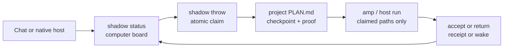

<p align="center"></p>

# Shadow

Shadow keeps one durable workboard per computer and the work itself in each
project's `PLAN.md`. It tells a native coding host what to do next, tracks
ownership, and records proof so a chat can end without losing the task.

**Shadow is you, one step down.** The slogan is the stance: you set intent;
Shadow reconstructs the work, chooses a reachable next move, and keeps the
loop recoverable.

## The loop



The board at `~/.shadow` owns project priority, entity pointers, claims,
owners, and resume. The committed entity `PLAN.md` owns milestones,
checkpoints, detail, and proof. The browser, a chat transcript, a worktree
copy, or a provider's private plan is never a competing authority.

## Install once

```bash
git clone https://github.com/firstbitelabsllc/shadow.git
cd shadow
bash install.sh
shadow doctor
```

Requirements are Git, Bash, Python 3.10+, and a supported native host. There is
no Node, npm, database, daemon, or transcript store. The clone is the install;
`git pull` updates it. `install.sh` mounts the same checkout into the host
skill roots and writes Shadow's managed standing-goal block into Claude Code
and Codex instruction files. Cursor's skill mount and sealed host runner are
supported, but file-backed cold directive activation is deliberately
unsupported until Cursor exposes a reviewed user-rule surface.

`shadow doctor` checks installation and host wiring. It does not prove a live
session loaded the skill. For that boundary, use the offline verifier first and
then the quota-bearing live check when you have a stable board:

```bash
scripts/shadow-verify-host.sh --host claude-code --by claude
scripts/shadow-verify-host.sh --host codex --by codex --live
```

To prove two independent seats can coordinate instead of merely describe one
board, run the sealed disposable harness. Its default uses deterministic local
seat drivers and no model quota. Live mode is explicit and requires one frozen
seat-neutral goal file; it runs Claude and Codex only inside a fresh scratch
HOME and two disposable local repositories:

```bash
scripts/shadow-python.sh scripts/shadow-verify-two-seat.py --json
scripts/shadow-python.sh scripts/shadow-verify-two-seat.py \
  --live --goal-file ./frozen-goal.txt --json
```

The receipt proves the shared goal hash/ref, two distinct historical owners,
overlapping peer-visible claims, two completed proofs, and zero orphan claims.
Live mode also requires the running checkout to be clean and exactly at the
freshly fetched ref. The harness never completes the person-observed gate on
its own.

## First run: one complete handoff

Run this from a Git project. The only placeholder you replace is the stable
seat name; copy the exact row id and command that `shadow status` prints.

```bash
shadow init --here                 # creates PLAN.md; never overwrites one
$EDITOR PLAN.md                    # fill the Brief and one typed task/proof
shadow lint PLAN.md
shadow status --by your-seat      # reads the computer board and prints next moves
shadow throw --repo . --task '~ab12' --by your-seat
shadow amp --repo . --by your-seat # or use shadow host run for a sealed host
# do the claimed work, then reproduce its proof
shadow accept --repo . --row '~ab12' --by your-seat
shadow status --in-flight --json   # leave a resumable handoff
```

Task ids look like `~ab12`; quote them in zsh so the shell does not expand the
tilde before Shadow runs. `shadow accept` is the only command-proof flip path.
For a person-observed `read` or `gate` proof, record the result in `PLAN.md`
and use `shadow return`. For a blocked task, record one exact Deferred wake
before returning the claim.

For the other shipped rails, use the same explicit projections:

```bash
shadow goal --install --host codex     # install the static host instruction block
shadow host probe --host codex --json  # probe without running a task
shadow buckets --json                  # show optional method slots and fallbacks
shadow lifecycle --repo . --json       # report hot-plan limits; never guesses deletion
```

The exhaustive flag and exit-code reference lives in
[Commands](docs/reference/commands.md); this page keeps one first-success path
instead of becoming a second CLI manual.

## Proof boundaries

These are separate receipts, not synonyms:

- A green command proves source behavior in the checkout where it ran.
- A merged commit proves protected `origin/main` contains that source.
- An install/stranger-install check proves a fresh package can wire the tool.
- A live host check proves one real host session loaded and described the board.
- Deployment, external delivery, and customer/runtime behavior need their own
  owning-plan evidence; Shadow never infers them from CI, a demo, or a receipt.

## At the end of every Shadow chat

Render a compact **Ongoing tasks** footer from a fresh
`shadow status --in-flight --json` read (claims first), joined with the current
seat's reachable and waiting rows from `shadow status --json --by <seat>`:

```text
Ongoing tasks
- project/outcome — checkpoint; owner; state; next proof or exact wake
Active tasks: none
```

Use the empty line only when the board has no ongoing claims or waiting work.
This footer is a projection of the board, not a second queue: never hard-code
stale status, copy private paths/provider data, or turn a chat message into
authority.

## What Shadow will and will not do

Shadow will coordinate every reachable project lane, preserve one writer per
claim, prepare a bounded host handoff, and leave proof plus a successor. It
will refuse unclaimed execution, missing proof, dirty or ambiguous authority,
and unsupported host activation rather than guess. Native hosts keep their own
authentication, model, and billing choices.

## Find the exact contract

- [Installation](docs/guide/installation.md) — mounts, upgrades, and host limits
- [Quick start](docs/guide/quickstart.md) — the full claim/proof loop
- [Use Shadow in more places](docs/guide/publishing.md) — honest ChatGPT, Codex, Claude, Cursor, Custom GPT, and MCP boundaries
- [Commands](docs/reference/commands.md) — every verb and flag
- [Host integration](docs/reference/host-integration.md) — cold-start behavior
- [Native hosts](docs/reference/native-hosts.md) — sealed runs and activation
- [Method](docs/reference/method.md) — the operating cycle and adversarial step
- [Plan grammar](docs/reference/grammar.md) — durable plan rules
- [Amp](docs/reference/amp.md) · [Buckets](docs/reference/buckets.md)
- [Privacy](docs/reference/privacy.md) · [Other-computer handoff](docs/guide/other-computer-handoff.md)

## Develop Shadow itself

```bash
scripts/shadow-python.sh -m unittest discover -s tests -p 'test_*.py'
scripts/shadow-public-ready-grep-gate.py --tracked-only --metadata
```

The method is one page in [`AGENT.md`](AGENT.md), with the durable grammar in
[`docs/reference/grammar.md`](docs/reference/grammar.md). Keep source/test,
merge, install, and live-dogfood evidence distinct when changing the repo.

Shadow is released under the [MIT License](LICENSE).
