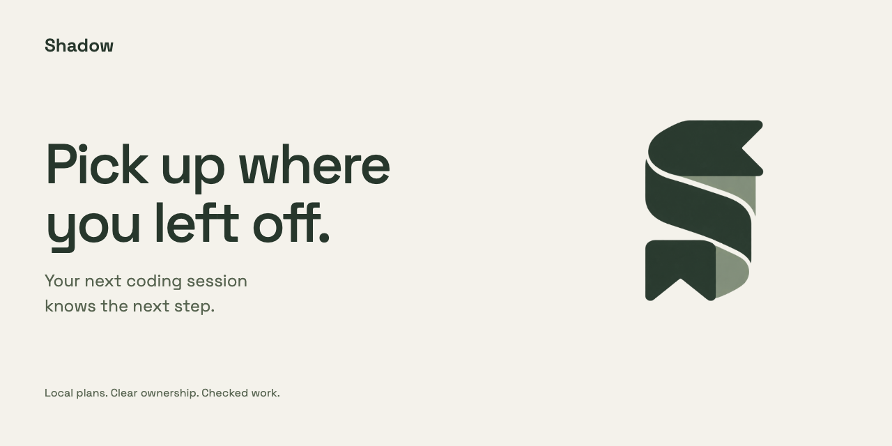
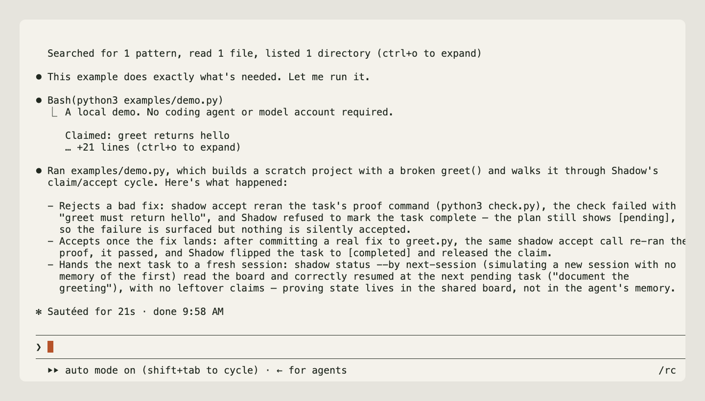

# Shadow

**Pick up where you left off.**

Keep the plan, who owns the work, and the next step on your computer.
Open a new coding session and continue.



[Watch the demo](docs/public/shadow-demo.mp4) · [Documentation](https://firstbitelabsllc.github.io/shadow/) · [MIT license](LICENSE)

## Ask your coding agent to try it

Python 3.10+, Git, and Bash on macOS or Linux.

Open this repository in Claude Code and paste:

```text
Show me how Shadow handles a failing check and finds the next task. Run the local example and explain the result.
```

Or open this repository in Codex and ask:

```text
Run the local Shadow example, then show me how it handles a failing check and finds the next task. Explain what happened.
```

`examples/demo.py` creates a scratch repository with a failing greeting test.
The script makes the demonstrated fix, Shadow reruns the check, and a fresh
command finds the next task. It uses no model account and removes its temporary
repository and board when it finishes.

### Run it yourself

```sh
git clone https://github.com/firstbitelabsllc/shadow.git
cd shadow
python3 examples/demo.py
```

## Use it with your project

Ask your coding agent to set up Shadow from the
[installation guide](docs/guide/installation.md), then use the command-line
reference below when you need the exact commands.

From the clone:

```sh
bash install.sh
export PATH="$HOME/.local/bin:$PATH"
shadow doctor
```

Installation links to this clone; keep it in place. For a tagged release and
coding-tool setup, see [installation](docs/guide/installation.md).

In a Git project:

```sh
shadow init --here
shadow status --by your-name
```

Open the `PLAN.md` path printed by `init`. Describe the outcome and give each
task a check that would demonstrate it is done. `status` prints the command
to claim the next available task. Use the same worker name each session.

After making and committing a change, `shadow accept` reruns the task's check
against that committed source. A failed check leaves the task open. Follow
the [complete first-task walkthrough](docs/guide/quickstart.md) for the exact
claim and acceptance commands.

## What carries over

There is one board per computer. It records priorities and ownership. A durable
`PLAN.md` for each independently managed piece of work records its tasks and
evidence. Related plans can form a [project map](docs/reference/project-maps.md).

Your next coding session reads those same files. The board can show unfinished
work owned by your stable worker name, or the next task available to claim.

Shadow runs trusted local commands. A weak test can pass a bad change; you still
need checks that exercise the behavior you care about. Claims may also use a
tracked Git remote to coordinate across computers. [Privacy and boundaries](docs/reference/privacy.md).

## Go further

- [Commands](docs/reference/commands.md): flags, return codes, and examples.
- [Coding-tool integration](docs/reference/host-integration.md): use the tools you already run.
- [Contributing](CONTRIBUTING.md): make a small change and run the relevant checks.

Confused at a step, or a task accepted that should have failed?
[Open an issue](https://github.com/firstbitelabsllc/shadow/issues) with a small example.
