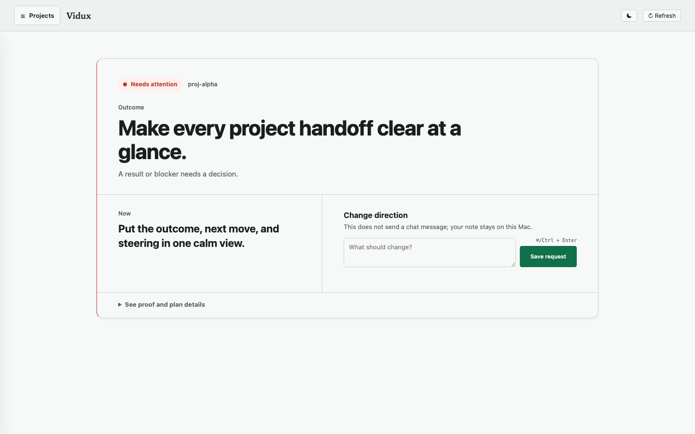
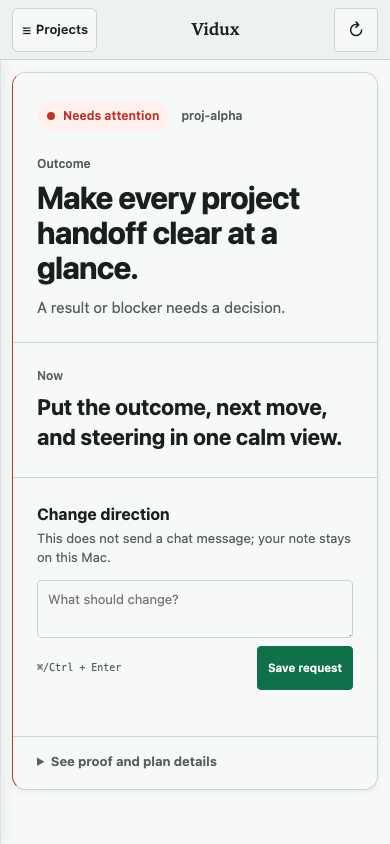

<p align="center"></p>

<p align="center">
  <a href="https://github.com/firstbitelabsllc/vidux/actions/workflows/ci.yml"></a>
  <a href="LICENSE"></a>
  
</p>

# Pilot Puppy

One calm, local view of AI-assisted project work: the outcome, what is happening now,
a place to change direction, and proof. One `PLAN.md` keeps it durable.

**Pilot Puppy** is the friendly product; Vidux remains its public plan/proof compatibility core. Native Codex, Claude Code, and Cursor execute locally when their bounded host adapter returns `pilot.host-receipt.v1`; the generic provider bridge remains non-native. 90 is the internal nickname for Pilot Puppy's planned on-the-go briefing and choice mode, not a separate product or runtime, and it is not shipped in `1.2.0`. [Boundary](docs/reference/pilot-puppy.md).

## Install
Needs Bash, Git, and Python 3. Node is only for contributor tests and docs.
```bash
git clone https://github.com/firstbitelabsllc/vidux.git
cd vidux
mkdir -p "$HOME/.local/bin"
ln -sfn "$(pwd)/bin/vidux" "$HOME/.local/bin/vidux"
export PATH="$HOME/.local/bin:$PATH"
vidux doctor
```
## Quick start

```bash
cd /path/to/your/project
vidux init --here    # creates PLAN.md only if missing
vidux status
vidux browse         # local cockpit (loopback by default)
```
The browser opens one Outcome card. Projects, diagnostics, and the full plan stay
tucked away. A Steer stays local; it does not send chat or launch a model. `vidux status`
scans `VIDUX_DEV_ROOT` (default `~/Development`). [Config](vidux.config.example.json).
<p align="center"></p>
<p align="center"></p>
The card answers: What is the outcome? What is happening now? Does the work need me?
Where is the proof? Open **See proof and plan details** for evidence and the full
plan. Missing or unlinked proof stays explicit as **No proof yet** or **Proof is
still being gathered** (`PROOF MISSING` in the durable contract) until a repository evidence file exists.
## Agent skill

Root [`SKILL.md`](SKILL.md) is Pilot Puppy's agent entry. Claude Code is the tested host for the stable `/vidux` compatibility skill mount; other hosts are untested by this skill mount. The shared Pilot host adapter separately records bounded Codex, Claude Code, and direct Cursor proof; a login check or model list is not execution proof. Mount with `ln -sfn /path/to/vidux "$HOME/.claude/skills/vidux"`.

## Where Pilot Puppy stops

Pilot Puppy does not schedule agents, route models, execute workers, or hold provider
credentials. Vidux, its compatibility core, can record provider-neutral claims, but it never launches a provider
or selects a model. The dashboard and optional checkpoint ledger are local; neither
replaces the repository plan.

`vidux checkpoint` requires proof text before completing a row and leaves its
plan edit uncommitted unless `--commit` is explicit.

## Outcome / Ask / Steer interchange

Pilot Puppy `1.2.0` includes provider-neutral JSON for one Outcome, an optional exceptional Ask,
Steers, and proof references. The GUI defers Ask until dogfood reveals a genuine fork. The interchange is separate from the GUI; it is not a worker runtime, shared-memory layer, or live model-steering claim.

The companion `vidux.lifecycle.v1` receipt records the bounded transition history
that a start-to-finish driver can hand back to Pilot Puppy. It remains provider-neutral
and proof-referencing only:

```bash
python3 scripts/vidux-lifecycle-validate.py \
  --input examples/lifecycle-receipt/example.json
```

See the [lifecycle receipt contract](docs/reference/lifecycle-receipt.md).

```bash
python3 scripts/vidux-outcome-validate.py \
  --input examples/outcome-ask-steer/example.json
```

The read-only validator emits deterministic JSON: exit `0` valid, `1` invalid, or `2`
invocation/I/O failure. See the [contract](docs/reference/outcome-ask-steer.md) and
[schema](schemas/outcome-ask-steer.v1.json).
## Docs

Root is install + agent entry; deeper material stays in docs:
[Architecture](docs/doctrine/ARCHITECTURE.md) · [Doctrine](docs/doctrine/DOCTRINE.md) · [Loop](docs/doctrine/LOOP.md) · [Enforcement hooks](docs/doctrine/ENFORCEMENT.md) · [Core boundary](docs/CORE-CUT.md) · [Evidence format](guides/evidence-format.md) · [Site / guides](docs/)
Community: [CONTRIBUTING](CONTRIBUTING.md) · [SECURITY](SECURITY.md) · [SUPPORT](SUPPORT.md) · [CODE_OF_CONDUCT](CODE_OF_CONDUCT.md)
Repo `PLAN.md` (if present) is this repository's working authority; it is not required to use Pilot Puppy in your project.
## Release truth

`VERSION` marks `1.2.0`. A release is valid only when its tag and GitHub Release resolve
to the same commit; there is no npm package. The historical [`v1.1.1` release](https://github.com/firstbitelabsllc/vidux/releases/tag/v1.1.1)
remains unchanged. This release adds the Outcome-first local view without turning Pilot Puppy
into a model runner or hosted control plane.

## Contributing

```bash
npm ci
npm run verify
```
MIT licensed.
