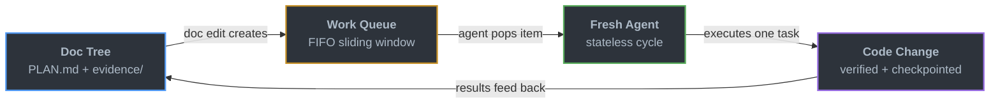
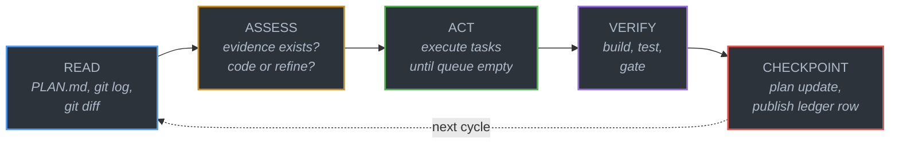

<p align="center">
  
</p>

<p align="center">
  <a href="https://github.com/firstbitelabsllc/vidux/stargazers"></a>
  <a href="LICENSE"></a>
  <a href="https://github.com/firstbitelabsllc/vidux/commits/main"></a>
</p>

# Vidux

  

Tests run locally (`npm run verify`) before every merge — GitHub Actions CI is intentionally manual-only for build/test/lint (see the `DISABLED / MANUAL-ONLY POLICY` headers in `.github/workflows/{ci,lint,test}.yml`; secret scanning still runs automatically on every push/PR via `.github/workflows/secret-scan.yml`), so there's no live CI badge here rather than a stale one.

**Plan first, code second.** AI coding agents forget everything when the chat window closes. Vidux gives them a paper trail instead — one plain-text file that survives sessions, tools, and days, so the next agent (or the next you) never starts blind.

- **One planning authority** — every project gets a single `PLAN.md`: what's queued, what's decided, what's done. No database, no app to sign into.
- **Proof travels with the handoff** — when one AI work session ends and a new one starts later, `PLAN.md` + publish ledger rows say what got done, how to double-check it actually works, and exactly where to pick up.
- **Every run starts clean** — each session reads the plan, does one task, writes down what happened, and exits. No hidden memory, no drift between what an agent "remembers" and what's actually true.
- **Works with whatever you already use** — Claude Code, Cursor, Codex, or anything else that can read a markdown file.

<p align="center">
  
</p>

## Quick Start

```bash
git clone https://github.com/firstbitelabsllc/vidux.git ~/Development/vidux
ln -sf ~/Development/vidux/bin/vidux /usr/local/bin/vidux
vidux dev
```

The clone target matters: the browser's default scan root is `~/Development`
(see below), so cloning vidux as a **child** of `~/Development` — not as a
sibling like `~/vidux` — is what makes "your plans show up automatically"
literally true with zero extra config. Keep your dev tree somewhere else?
Set `VIDUX_DEV_ROOT=/path/to/your/dev-root` before `vidux dev`/`vidux browse`
instead of relocating vidux itself.

`/usr/local/bin` is root-owned by default on most current macOS and Linux
installs, so that `ln -sf` can fail with `Permission denied`. If it does, skip
straight to **Option B** below (add `bin/` to your `PATH` instead — no `sudo`
needed) and re-run `vidux dev`.

Opens the plan browser at <http://127.0.0.1:7191> with auto-restart on `browser/` changes.

Want a real plan instead of the browser's own example plans? `vidux init my-project` scaffolds a first `PLAN.md` **inside this vidux checkout**, at `projects/my-project/PLAN.md` — not in whatever directory you happen to run it from. Because the browser scans your whole dev-root tree (`~/Development` by default, or `VIDUX_DEV_ROOT` if you set it), that new plan shows up automatically without any extra wiring, as long as vidux itself was cloned inside that tree. Vidux works this way so one vidux install can act as a single dashboard over many separate projects' plans; if you'd rather a project's `PLAN.md` live directly in that project's own git repo, just create `PLAN.md` by hand at its root (see `plan_store` under [Status & Config](#status--config) for how agents resolve which `PLAN.md` is authoritative). Use `vidux help` for the full command list.

## Install

### Option A — symlink into PATH (recommended)

```bash
ln -sf <vidux-dir>/bin/vidux /usr/local/bin/vidux
```

### Option B — add `bin/` to PATH

```bash
echo 'export PATH="<vidux-dir>/bin:$PATH"' >> ~/.zshrc
exec zsh
```

Verify with `vidux --version`.

### Claude Code skill (optional)

Symlink this repo as a `/vidux` skill and copy optional enforcement hooks into a target repo:

```bash
ln -sfn <vidux-dir> ~/.claude/skills/vidux
cp hooks/pre-commit-plan-check.sh /path/to/your/project/.git/hooks/pre-commit
cp hooks/post-commit-checkpoint.sh /path/to/your/project/.git/hooks/post-commit
cp hooks/three-strike-gate.sh /path/to/your/project/.git/hooks/
```

Run `/vidux "your project description"`. The first cycle gathers evidence and writes a `PLAN.md`. No code is written until the plan is ready.

### Claude Code plugin path (alternative to the manual symlink above)

This repo also ships a `.claude-plugin/plugin.json` manifest, so `claude
--plugin-dir <vidux-dir>` (or a marketplace install, once published) works as
an alternative to the manual symlink in the section above — pick one path,
not both. The root `SKILL.md` (auto-loaded by the plugin's directory
convention) and `commands/vidux.md` (also auto-scanned, as the `/vidux` slash
command) used to both declare `name: vidux`; `commands/vidux.md`'s frontmatter
name is now `vidux-orchestrate` to remove that collision outright — `/vidux`
still works as the slash command (that trigger comes from the filename, not
the frontmatter name), and a bare `Skill(skill: "vidux")` call now
unambiguously resolves to the root `SKILL.md`.

## Multi-platform notes

vidux is developed on macOS but core scripts are POSIX-compatible:
- All Python scripts use `python3` shebangs and stdlib only
- `vidux-browse` is `http.server` + plain HTML/JS — runs anywhere Python runs
- Cron integration: macOS uses launchd plists; Linux users should adapt to systemd timers or cron

## Vidux Browse

A local browser surface for reading plans, scanning the fleet queue, reviewing HTML artifacts, and leaving comments without editing source files:

```bash
bin/vidux-browse
```

Opens `http://127.0.0.1:7191`. Set `VIDUX_BROWSER_HOST=0.0.0.0` only on a trusted LAN to expose the same machine's plans to another device, and open it by the server's private IP address (for example, `http://192.168.1.50:7191`). LAN-bound requests with a domain Host are rejected to prevent DNS rebinding.

The browser keeps the plan contract intact:

- The default pane is a read-only fleet dashboard for in-progress, blocked, and open `ASK-LEO.md` entries.
- The sidebar filters by repo/slug/purpose and sorts plan groups by `mtime`, remaining `ETA`, or freshness.
- Each plan has a read-only `Ledger` tab for recent proof rows from `${VIDUX_LEDGER_FILE:-~/.agent-ledger/activity.jsonl}`.
- Plan files and artifacts render from disk; comments are separate append-only app data.
- Allowed text and JSON metadata pass through a high-confidence sensitive-value redaction boundary; affected plans stay visibly marked, while artifact/comment/plan-note writes reject matches.
- Comment anchors are display pointers, never source edits: they never mutate `PLAN.md`, repo code, task claims, or artifact HTML.
- Plan-note writes are loopback-only; LAN viewers can comment but cannot write plan state.

See [`docs/reference/browser.md`](docs/reference/browser.md) for the HTTP surface and safety model.

## How It Works

Every change flows through a four-stage loop. Plan/proof files are the control plane.



Inside each run, five steps execute in order. None is skippable:



If the code is wrong, the plan is wrong — fix the plan first. The owning plan plus publish ledger proof persists across sessions; each run dies. Any fresh agent rehydrates from repo docs and ledger rows, then continues.

## Why It Exists

Most agent failures are state failures:

- the plan lived in chat instead of files
- code was written before evidence existed
- a later session could not tell what was intentional
- the same bug got "fixed" three different ways

Vidux makes repo-local plan/proof files the recovery packet. `PLAN.md` lives in git; publish ledger rows live in the append-only ledger. No databases, no daemons, no memory tricks.

## Where Vidux Sits

There's "just chat with the agent and hope it remembers" on one end, and full multi-agent orchestration frameworks — Hermes Agent, LangGraph, CrewAI, AutoGPT, MetaGPT — on the other. Those frameworks are genuinely more capable at what they're built for: always-on agents, complex conditional workflows, dozens of coordinated roles. But that capability comes with real apparatus — and most coding work doesn't need it. It needs one thing done well: keep a plan coherent across sessions, tools, and days.

Vidux is the middle: more structure than bare chat, meaningfully less than an orchestration platform.

| | Vidux | Orchestration frameworks (Hermes Agent, LangGraph, CrewAI...) |
|---|---|---|
| **Concepts to start**\* | 3 — a plan file, an append-only proof log, one 5-step cycle | 4–6+ — e.g. Hermes Agent's Skills/Memory/Toolsets/Gateway/Context Files/Personalities; CrewAI's Agent/Task/Tool/Crew plus a Process concept |
| **Required infra** | None beyond git + Python's standard library | Often a database and a service: LangGraph's self-hosted deploy needs Docker, Postgres, and Redis; Hermes Agent's own docs describe it running on anything from a $5 VPS to a GPU cluster to serverless, with no required background service for its core loop |
| **Setup to first run** | `git clone` + one symlink + `vidux dev` | Hermes Agent: install script, then `hermes setup --portal` — one command for OAuth + Nous Portal's 300+ frontier models + Tool Gateway (web search, image gen, TTS, browser) |
| **Where state lives** | A markdown file and a JSONL log, readable by any human or agent | Often inside a database schema (e.g. Postgres JSONB/BYTEA columns) that needs a driver to inspect |

\* Enough to write and run your first `PLAN.md`. `SKILL.md` (the full doctrine, including scheduling, multi-agent lanes, and edge cases) is much longer — most of it is reference material you'll never need to read.

None of this makes vidux "better" — it's a different set of tradeoffs. Vidux's core actually does support scheduled/persistent loops, multi-agent lane coordination, and PR-nursing (see SKILL.md's Persistent Loop Mode, Nursing Mode, and Coordination Mode sections) — it just does it with cron/launchd, plain files, and git instead of a framework's built-in Agent/Task/Crew abstractions or a hosted service. If you want those abstractions doing the wiring for you, or need dozens of coordinated roles out of the box, reach for one of those frameworks. If you want the same capabilities built from primitives you can read in a text editor, that's what vidux is for.

**This design isn't a guess — it's the result of measuring a fancier version and cutting it.** Vidux used to also try to structure *how* work handed off between a planning step and an executing step (a "kernel" transport format). A 2026-07-03 evaluation (119 runs, 117 clean after protocol exclusions) tested that structured handoff against just letting an agent work freeform off the same plan file — freeform won on every frozen threshold. The clearest single head-to-head (17 runs each, same model) had freeform resolving 76% vs. the kernel handoff's 59%. So the structured-handoff layer was cut. What's left, and what this README describes, is what actually earned its keep: one plan file, one proof log, one cycle. See the 2026-07-07 Decision Log entry in `PLAN.md` and `evidence/2026-07-07-kernel-cut-pivot.md` for the full writeup (the evaluation harness itself is a local-only, unshipped tool — this repo carries the result, not the harness).

## How Vidux Compares

| | Vidux | Raw Claude Code / Cursor | Aider / OpenCode |
|---|---|---|---|
| **State** | `PLAN.md` + publish ledger rows — survives sessions, agents, days | Chat history — dies when the window closes | Session-scoped context |
| **Multi-agent** | Any agent reads the same plan/proof packet and picks up | Single agent per session | Single agent |
| **Verification** | Evidence → plan → execute → verify → checkpoint | Trust the output | Trust the output |
| **Automation (opt-in)** | Scheduled lanes read the same plan/proof packet | N/A | N/A |
| **Agent agnostic** | Claude, Cursor, Codex — anything that reads markdown | Tool-specific | Provider-agnostic: OpenCode via the AI SDK + Models.dev registry (75+ providers); Aider via LiteLLM |

Vidux doesn't replace your coding agent — it gives your agent a memory that outlasts the session.

## Core Invariants

Hard rules that prevent the most common stateless-agent failures:

**One project, one `PLAN.md`** — course corrections update the existing plan's Decision Log; they never spawn a sibling plan.

**Compound tasks link to an investigation file** — messy surfaces get a compound task pointing at `investigations/<slug>.md` with seven sections (Reporter Says / Evidence / Root Cause / Impact Map / Fix Spec / Tests / Gate). The investigation IS the work until the Fix Spec is filled; then fix and investigation ship as one commit. One investigation per compound task, no deeper nesting.

**Append-only logs** — `## Progress`, the optional `## Drift Log`, and each lane's `memory.md` are append-only. Corrections go in new entries. Use `vidux drift` when implementation diverges from the plan.

**A merge never silently deletes tasks** — `.gitattributes` unions `PLAN.md` conflicts, and `scripts/vidux-plan-guard.sh` records the task count at every checkpoint and flags an unexplained drop on the next read (`plan_integrity_warning` in `vidux-loop.sh`'s JSON). Intentional cuts are authorized with a dated `- [DELETION] [YYYY-MM-DD] ...` Decision Log entry. See `investigations/2026-04-09-plan-clobber-postmortem.md`.

**3x stuck rule** — same task in 3+ consecutive progress entries while in-progress reports a stuck state by default; auto-blocking it in `PLAN.md` (flip to `[blocked]` + a Decision Log entry) is opt-in via `VIDUX_LOOP_AUTO_BLOCK=1`. Brake, not kill.

## Status & Config

```bash
python3 scripts/vidux-status.py
vidux config check
vidux doctor
vidux http-smoke --json --timeout 3 http://127.0.0.1:4400/api/health
```

Scans every `PLAN.md` under a scan root (default `~/Development`, or `VIDUX_DEV_ROOT`/`--root` if set), renders a two-bucket board: plans tied to the current repo vs everything else on the machine. Each row: 10-cell progress bar, remaining AI-hours (sum of `[ETA: Xh]` tags), last activity. Flags: `--all`, `--json`, `--focus <repo...>`, `--root <path>`.

Config lives at a local, gitignored `vidux.config.json` (the repo ships `vidux.config.example.json` as the shape). The only required key is `plan_store`, whose `mode` is `inline` (repo-local `PLAN.md`, the default), `local` (a configured path), or `external` (a path outside the scan root). Agents resolve the authority `PLAN.md` from this at session start. Use `vidux config init` to seed a local config; full schema in [`docs/reference/config.md`](docs/reference/config.md).

`vidux doctor` is the install/readiness doctor (can run `npm test`); `scripts/vidux-doctor.sh --json` is the hook-safe probe. `vidux http-smoke` runs observe-only route budget checks: partial responses inside budget are `warn_partial`, zero-byte misses are `fail_budget`. On a fresh clone, run `npm install` first (see [Running the tests locally](CONTRIBUTING.md#running-the-tests-locally)) — `vidux doctor`'s `npm test` check needs `node_modules` present and otherwise fails with an opaque "command not found" instead of an actionable message.

## What Ships Here

| Path | What |
|------|------|
| `SKILL.md` | Core discipline — five principles, the cycle, PLAN.md template, decision trees |
| `DOCTRINE.md` | The short doctrine (~5 min read) |
| `LOOP.md` | Stateless cycle mechanics |
| `ENFORCEMENT.md` | Claude Code hook configuration |
| `INGREDIENTS.md` | Design lineage (10 patterns from 26 surveyed tools) |
| `CHANGELOG.md` | Release notes and migration notes |
| `commands/` | `/vidux` (main cycle) and `/vidux-status` (read-only board) |
| `scripts/` | Cycle, status, config, doctor, drift, signpost, HTTP smoke, GC, worktree, and migration helpers |
| `scripts/lib/` | Shared shell libs (compat, codex-db, ledger, queue, plan-store resolution) |
| `hooks/` | Prompt-hook nudges for plan discipline |
| `guides/` | automation, draft-pr-flow, evidence-format, fleet-ops, harness, investigation, recipes/ |
| `references/` | `automation.md` — historical/operator automation details loaded only on demand |
| `tests/` | Contract and lifecycle tests |
| `examples/` | Worked examples (start with bug-fix lifecycle) |

## Ecosystem

Vidux's main entry point is `/vidux`, loading the core discipline inline. `/vidux-status` is a second, narrower shipped command — a read-only status board, not an alternate way to run the cycle.

| Skill | What it does | Ships here? |
|---|---|---|
| `/vidux` | Plan-first cycle — read, assess, act, verify, checkpoint. Automation + recipes loaded on demand | Yes |
| `/vidux-status` | Read-only scan of `PLAN.md` files across the machine, rendered as a status board | Yes |
| `/ledger` | Append-only JSONL activity log for multi-agent coordination | No (separate) |

## Automation (opt-in)

The cycle works for humans, one-shot sessions, and scheduled lanes. The automation layer is opt-in — load it only when the task calls for it. It covers session-gc, JSONL growth control, lane bootstrap, and PR-lifecycle nursing. Runner/model selection belongs to the host runtime or Flow; core Vidux only preserves plan, proof, decision, and resume truth.

Patterns:
- **Ready-PR-first** — push ready-for-review by default so review bots run; draft is for true WIP or missing gates.
- **Progress is code change** — PRs touching only `PLAN.md` / `investigations/` / `evidence/` are bookkeeping; bundle plan updates into the code PR or keep notes local.
- **`observed` evidence type** — user-observed app behavior is first-class plan evidence.
- **3x stuck rule** — same task in 3+ consecutive progress entries reports a stuck state by default (auto-blocking it in `PLAN.md` is opt-in via `VIDUX_LOOP_AUTO_BLOCK=1`).

Guides: [automation](guides/automation.md), [references/automation](references/automation.md), [fleet-ops](guides/fleet-ops.md), [recipes](guides/recipes.md), [recipe catalog](guides/recipes/), [draft-pr-flow](guides/draft-pr-flow.md), [subagent-delegation](guides/recipes/subagent-delegation.md).

## Documentation

- [Architecture](ARCHITECTURE.md) — three-layer overview with diagrams
- [Harness Setup](guides/harness.md) — writing automation prompts
- [Evidence Format](guides/evidence-format.md) — structuring evidence files
- [Investigation Lifecycle](guides/investigation.md) — the parent-plan + child-investigation pattern
- [Examples](examples/) — start with [bug-fix lifecycle](examples/bug-fix-lifecycle/)

## Sibling Project

**[claudux](https://github.com/firstbitelabsllc/claudux)** — documentation generator with multi-backend AI support. If vidux is "plan before code," claudux is "docs before code."

## Contributing

This repo is public for reuse, critique, and feedback. Track feedback through [GitHub Issues](https://github.com/firstbitelabsllc/vidux/issues).

See [CONTRIBUTING.md](CONTRIBUTING.md) for contribution guidelines and [SECURITY.md](SECURITY.md) for the vulnerability reporting policy.
