# Shadow

**Keep your AI coding work when the conversation ends.**

You switch from Claude Code to Codex. The new session needs to know what you
wanted, what changed, who is already working, and what still needs checking.
Shadow keeps that handoff in local plans, so you can resume the work without
reconstructing it from chat history.

It is a CLI for durable plans, agent coordination, and verifiable completion.
Your coding host runs the model. Shadow records ownership and checks the
proof you chose before marking a checkpoint done.

[Get started](#install) · [Walk through a first task](https://github.com/firstbitelabsllc/shadow/blob/shadow-1.3.0/docs/guide/quickstart.md) ·
[Read the docs](https://firstbitelabsllc.github.io/shadow/) ·
[Report a problem](https://github.com/firstbitelabsllc/shadow/issues)

<p align="center">
  <a href="https://github.com/firstbitelabsllc/shadow/actions/workflows/ci.yml"></a>
  <a href="LICENSE"></a>
  
  
</p>

<p align="center"></p>

## What survives a handoff

| Without a shared plan | With Shadow |
| --- | --- |
| The next chat starts with a recap. | The next session reads the saved outcome and resume point. |
| Two agents can start the same task. | A checkpoint has one owner on the computer board. |
| “Done” is a message in a conversation. | Completion records the checkpoint's named proof. |

There is one board per computer and one authoritative `PLAN.md` per independently
steerable entity, such as a release or a documentation effort. Related entities
form a project map. The board stores ownership and priority; the plans store
the work and its proof.

| Term | Meaning |
| --- | --- |
| **board** | This computer's shared record of owners, priorities, and resume points. |
| **plans** | Local `PLAN.md` files containing checkpoints and their checks. |
| **seats** | Workers identified by stable names across conversations. |
| **claim** | Take ownership of a checkpoint before starting it. |
| **proof** | A command result, a recorded observation, or a human decision. |
| **accept** | Check the proof and record completion. |

The loop is **claim → work → prove → accept → next**.

## Install

Requires Git, Bash, and Python 3.10+. Use your existing coding host; the
installation guide in each release lists its supported integrations.

```bash
git clone --branch shadow-1.3.0 --depth 1 https://github.com/firstbitelabsllc/shadow.git
cd shadow
bash install.sh
export PATH="$HOME/.local/bin:$PATH"
shadow doctor
```

The installer links the CLI and host skills to this clone. Keep the clone in
place. To upgrade, check out the chosen [release tag](https://github.com/firstbitelabsllc/shadow/releases)
and rerun `install.sh`. See [installation](docs/guide/installation.md) for
host setup and troubleshooting. Features documented on `main` may be newer
than the pinned release; read the docs in your chosen checkout.

## Start in your project

From a Git repository you want to work on:

```bash
shadow init --here
shadow status --by your-seat
```

`init` prints the path of the new local plan. Open that exact path, fill in
the outcome, and define 2-7 tasks per milestone using the repository's real
checks. It refuses to overwrite an existing plan. Keep the same seat name
when you return in another conversation.

Keep the generated row IDs when editing the starter plan: the board already
uses one as its resume point. Change the task wording and proof, not that ID.

`status` prints the exact claim command for reachable work. Run it, make the
change, and commit the source before accepting a command-backed checkpoint.
For the **1.3.0 release installed above**:

```bash
shadow accept --repo . --row '~a1b2' --by your-seat
```

For **current development source**, also supply the machine-local entity ID:

```bash
shadow accept --entity ENTITY_ID --repo . --row '~ab12' --by your-seat
```

Use the entity and row from your plan. For example, a checkpoint that names a
regression test stays unfinished if that test fails. A passing test establishes
only what the test checks; it does not establish deployment or user adoption.

The [1.3.0 first-task guide](https://github.com/firstbitelabsllc/shadow/blob/shadow-1.3.0/docs/guide/quickstart.md) covers claiming, doing the
work, recording observations, and returning blocked work.
`shadow status --in-flight` shows current owners; `shadow browse` opens the
local board in your browser.

<p align="center"></p>

The same loop in real output, copy-pasteable (trimmed from a live session):

```console
$ shadow throw --repo . --task '~a1b2' --by demo
[throw] ~a1b2 claimed by demo on this computer
/goal readme-demo — first proof
AUTHORITY: PLAN.md @ this computer … — section "### M1 — first proof"
RESUME: [pending] hello.txt exists with today's greeting ~a1b2
PROOF: cmd test -f hello.txt
RAILS: … no proof, no completed; run `shadow lint` before mode flips …

# … you, Claude Code, or Codex does the work, then commits …

$ shadow accept --entity <id> --repo . --row '~a1b2' --by demo
accepted ~a1b2: proof and final lint passed at local.shadow.invalid/1e89… HEAD a22fe1d…; local row flipped with its PROOF and SOURCE lines
```

The plan now carries the receipt, so the next session needs no recap:

```text
- 2026-09-06T02:09:21Z ~a1b2 PROOF test -f hello.txt -> pass (accept)
- 2026-09-06T02:09:21Z ~a1b2 SOURCE local.shadow.invalid/1e89… HEAD a22fe1d… -> proof and final lint (accept)
```

## Why not just…

| Approach | What breaks |
|---|---|
| Chat history | dies with the session; no ownership; no proof anything ran |
| `TODO.md` | no claims, no atomicity; two agents race and the file lies |
| Issue tracker | built for humans at meeting cadence, not agents at claim cadence; lives in someone's cloud |
| Agent frameworks | a daemon, a second database, and a prompt router; your work lives in their format |

## Is it a fit?

Shadow is useful when you work across coding sessions or coordinate several
agents and need a shared answer to “what next?” and “what proves it?” A small
one-off edit usually needs no plan.

- **Local authority.** Plans stay on this computer. With a tracked upstream,
  claims also use `refs/heads/shadow/claims/v1/` on that remote for
  coordination; a repository with no upstream stays local-only.
- **Your host and account.** Native coding hosts own authentication and model
  execution. Optional sealed runs restrict the task scope; see the
  [execution policy](docs/reference/execution-policy.md).
- **Your proof.** Shadow can rerun a check, but a weak check can still pass.
  Command proofs are trusted local programs, not sandboxed code.
- **Explicit overlap handling.** [Huddle](docs/reference/commands.md#huddle-coordination)
  lets workers declare disjoint paths or hand work back to its owner.

The CLI needs no Node runtime, daemon, or transcript store.
[Configuration and optional extensions](docs/reference/config.md) are documented
separately from the first-run path.

### What Shadow is not

- **No daemon.** Nothing runs between commands; no watcher, no background service.
- **No cloud authority.** No remote task store, no credential relay, no account binding.
- **No prompt inspection.** Shadow never reads your conversations or provider traffic.
- **No transcript store.** Receipts carry names, statuses, and hashes, not prose or payloads.
- **Telemetry off by default**, local-only when opted in, recording no paths,
  commands, or text. See [privacy](docs/reference/privacy.md).

### Sealed delegation to a host

A claimed slice can run through a native host as a sealed pass: frozen task
file, exact allowed paths, scoped receipt. Hosts today: Claude Code, Codex,
Cursor, Grok, and Z.AI (or Codex pointed at Z.AI).

```bash
shadow host run --host codex --work-class coding --delegation direct \
  --repo "$PWD" --task-file /tmp/task.md --task-id focused-fix \
  --allowed-path src/fix.py --out .shadow/evidence/focused-fix.json
```

Four work classes (`planning`, `coding`, `review`, `lightweight`) and an
explicit execution shape (`direct` or `required`); unsupported child
capability fails closed, and a quota failure never silently falls back to
another provider. A receipt is evidence, not acceptance: review the diff and
reproduce the proof yourself. See the
[execution policy](docs/reference/execution-policy.md).

<details>
<summary>Advanced: completion proposals from a sealed host</summary>

A proposal-enabled machine-local row can use a sealed Codex no-change pass
with `--authority-proposal`, followed by `shadow accept --proposal`. Commit
the reviewed source first. Shadow binds the proposal to the exact row, owner,
claim, plan root, and source `HEAD`, then reruns its canonical proof with an
isolated temporary `HOME`. Git-backed plans, other hosts, and `read` or `gate`
proofs do not support proposals. See the [command reference](docs/reference/commands.md)
for the full invocation and refusal conditions.

</details>

## Use it, question it, build on it

Shadow is [MIT-licensed](LICENSE). Fork it for your own workflow. If a fresh
session loses the thread or a check accepts the wrong result, open an
[issue](https://github.com/firstbitelabsllc/shadow/issues) with a minimal,
sanitized example. First-use reports are useful even when nothing crashes.

External pull requests are currently closed; see [Contributing](CONTRIBUTING.md)
for the feedback policy and local tests. Read [Security](SECURITY.md) before
reporting a vulnerability.
