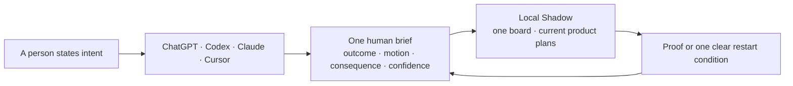

# Use Shadow in more places

Shadow has one local authority and several honest front doors. A new surface
must never pretend it can see current work when it cannot reach the computer's
board.



## What ships now

| Surface | What people get | Authority boundary |
| --- | --- | --- |
| ChatGPT and Codex | The `.codex-plugin` package and repo marketplace expose the same Shadow skill and goal shaper. | Full status and action require a local host that can read the board and run Shadow. A hosted chat is a coach only. |
| Claude Code | The existing `.claude-plugin` package installs the same source skill. | Local board access follows the existing install and host rules. |
| Cursor | The checked-in skill works through Cursor's local skill/plugin support. | Cursor can act only where the local checkout and host integration are available. |
| Custom GPT | The skill prose can seed a friendly “Shadow Coach” for goal shaping and explanation. | A Custom GPT is not real Shadow until a reviewed remote bridge exists. It must say that it cannot see the local board. |
| MCP directories | A future remote adapter could expose a privacy-safe brief and typed intent return. | No server is published today. The local board remains authority; a remote service may not copy the queue, credentials, or transcripts. |

Install the repo marketplace locally for a dry run:

```bash
codex plugin marketplace add /path/to/shadow
codex plugin add shadow@shadow
```

The same public listing can later be submitted once to the universal ChatGPT
and Codex directory. Claude, Cursor, and MCP directories keep their own review
and publishing steps. Submitting any external listing is a publishing action and
remains a person-authorized release step.

## Cut one immutable source release

The ordinary package check is a development receipt and is never sufficient
to call moving `main` publishable. Public-release mode requires an annotated
tag named `shadow-v<version>` at exact `HEAD`; legacy `v*` tags belong to the
older numbering epoch and never satisfy this check.

```bash
git tag -a "shadow-v$(cat VERSION)" -m "Shadow $(cat VERSION)"
scripts/shadow-python.sh scripts/shadow-release-package.py \
  --public-release --expect-version "$(cat VERSION)" --json
```

The green receipt names the exact commit, namespaced release ref, and
reproducible archive SHA-256. Pushing that tag, creating a GitHub Release, and
marking it Latest remain separate publication/readback steps; none is inferred
from the local receipt. The README stable-install command must already name the
same immutable tag before the tag is published.

## The one human brief

Every surface should answer the same questions before it exposes machinery:

1. What are we trying to change for a person?
2. What is moving now, in parallel?
3. What changed, and why does it matter?
4. What is stalled, and what single condition restarts it?
5. What decision or attention is needed?
6. How confident is the read, and which evidence is missing?

Branches, hashes, repository state, row IDs, commands, and raw receipts belong
in technical evidence on demand. They are not the story of the work.

## First success for a nondeveloper

A first-time user should be able to paste a rough goal and receive a useful
outcome, a plain-language current-state explanation, and one next move without
knowing Git or Shadow's plan grammar. Writing to the real board still requires
the local product until the typed remote-return contract is built and reviewed.

That split is deliberate: wide distribution may improve comprehension before
it earns remote authority, but it may never imply false parity.
