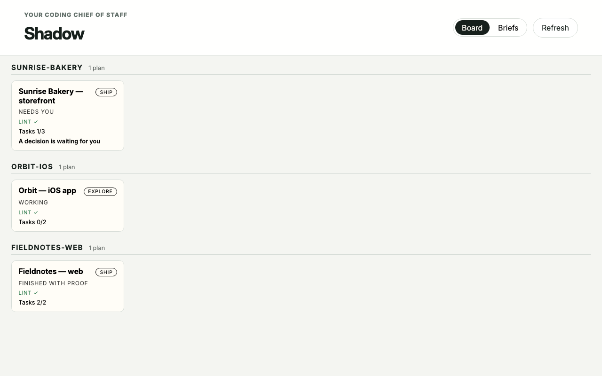

*The board: one card per project, with its mode, status, lint result, and task
counts. Running locally against a demo portfolio — Sunrise Bakery, Orbit, and
Fieldnotes are fictional projects; unedited screenshot of v4.0.x.*
